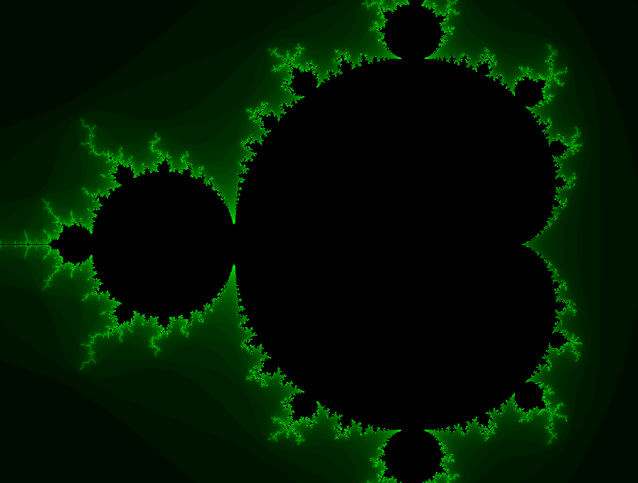
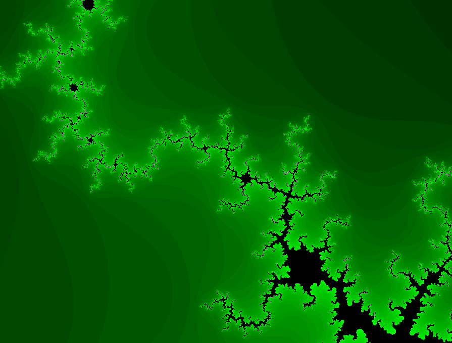

# Mandelbrot-set-SFML

This is an implementation of Mandelbrot set plotter in C++ SFML. Include the SFML dll's in the root directory if your SFML is statically linked.

Interactivity via mouse: 
	
	Left-clicking on a point centers the screen around that point

	Mouse wheel zooms in and out around the centered point

  
